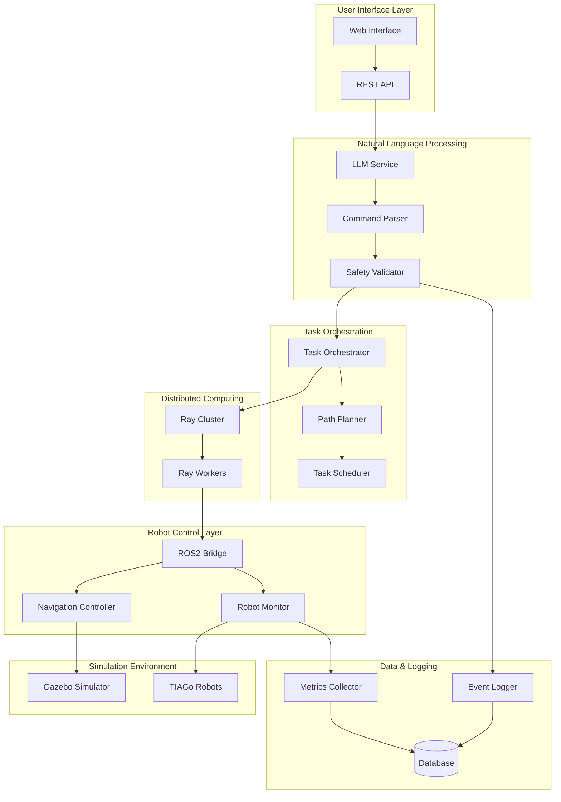

# Design Document

## Overview

The "ChatGPT for Robots" system is designed as a scalable, distributed robotics fleet control platform that bridges natural language interfaces with ROS2-based robot operations. The system leverages Large Language Models (LLMs) to translate human commands into executable robot actions, enabling intuitive control of multi-robot systems in simulated and real environments.

The architecture follows a microservices approach with clear separation between the natural language processing layer, task orchestration layer, robot control layer, and user interface components. This design ensures scalability, maintainability, and fault tolerance across the entire system.

## Architecture



## Components and Interfaces

### 1. Web Interface Component
**Purpose:** Provides user-friendly interface for natural language robot control

**Key Classes:**
- `FlaskApp`: Main web application server
- `CommandHandler`: Processes user input and displays responses
- `SimulationViewer`: Real-time visualization of robot states

**Interfaces:**
- REST API endpoints for command submission
- WebSocket connections for real-time updates
- Static file serving for UI assets

### 2. LLM Service Component
**Purpose:** Translates natural language to structured robot commands

**Key Classes:**
- `OpenRouterClient`: Manages API connections to OpenRouter
- `CommandTranslator`: Converts natural language to ROS2 commands
- `ModelManager`: Handles model selection (Mistral 7B/Llama 3)

**Interfaces:**
- HTTP client for OpenRouter API
- Internal command structure format
- Error handling and retry mechanisms

### 3. Safety Validator Component
**Purpose:** Ensures all commands meet safety requirements

**Key Classes:**
- `SafetyChecker`: Validates commands against safety rules
- `EmergencyStop`: Handles emergency shutdown procedures
- `CommandFilter`: Filters out potentially harmful instructions

**Interfaces:**
- Command validation API
- Emergency stop broadcast system
- Safety rule configuration interface

### 4. Task Orchestrator Component
**Purpose:** Manages distributed task assignment and execution

**Key Classes:**
- `TaskManager`: Coordinates task distribution across robots
- `RobotRegistry`: Maintains registry of available robots
- `TaskQueue`: Manages pending and active tasks

**Interfaces:**
- Ray distributed computing integration
- Robot status monitoring API
- Task assignment algorithms

### 5. ROS2 Bridge Component
**Purpose:** Interfaces with ROS2 ecosystem and robot hardware

**Key Classes:**
- `ROS2Publisher`: Publishes commands to ROS2 topics
- `ROS2Subscriber`: Listens to robot status updates
- `NavigationInterface`: Manages robot navigation commands

**Interfaces:**
- ROS2 topic publishers and subscribers
- Navigation2 action clients
- Robot state monitoring services

### 6. Simulation Environment Component
**Purpose:** Provides realistic testing environment for robot operations

**Key Classes:**
- `GazeboManager`: Controls Gazebo simulation lifecycle
- `RobotSpawner`: Manages robot instantiation in simulation
- `EnvironmentController`: Modifies simulation environment

**Interfaces:**
- Gazebo plugin system
- ROS2 simulation interfaces
- Environment configuration API

## Data Models

### Command Structure
```python
@dataclass
class RobotCommand:
    command_id: str
    robot_id: str
    action_type: str  # 'navigate', 'manipulate', 'inspect'
    parameters: Dict[str, Any]
    priority: int
    timestamp: datetime
    safety_validated: bool
```

### Robot State
```python
@dataclass
class RobotState:
    robot_id: str
    position: Tuple[float, float, float]
    orientation: Tuple[float, float, float, float]
    status: str  # 'idle', 'moving', 'executing', 'error'
    battery_level: float
    current_task: Optional[str]
    last_update: datetime
```

### Task Definition
```python
@dataclass
class Task:
    task_id: str
    description: str
    assigned_robot: Optional[str]
    status: str  # 'pending', 'assigned', 'executing', 'completed', 'failed'
    created_at: datetime
    estimated_duration: int
    dependencies: List[str]
```

### Performance Metrics
```python
@dataclass
class PerformanceMetrics:
    command_accuracy: float
    average_response_time: float
    task_completion_rate: float
    system_uptime: float
    active_robots: int
    commands_processed: int
```

## Error Handling

### 1. LLM Service Errors
- **API Rate Limiting:** Implement exponential backoff and request queuing
- **Model Unavailability:** Fallback to alternative models (Mistral → Llama)
- **Invalid Responses:** Retry with refined prompts, escalate to human operator

### 2. Robot Communication Errors
- **Connection Loss:** Automatic reconnection with exponential backoff
- **Command Timeout:** Task reassignment to available robots
- **Navigation Failures:** Dynamic replanning with obstacle avoidance

### 3. Safety Violations
- **Unsafe Commands:** Immediate rejection with detailed logging
- **Emergency Situations:** System-wide emergency stop activation
- **Validation Failures:** Command quarantine and manual review

### 4. System-Level Errors
- **Ray Cluster Failures:** Graceful degradation to single-node operation
- **Database Connectivity:** Local caching with eventual consistency
- **Resource Exhaustion:** Load balancing and resource scaling

## Testing Strategy

### 1. Unit Testing
- **Component Isolation:** Mock external dependencies (ROS2, LLM APIs)
- **Safety Validation:** Comprehensive test cases for edge conditions
- **Command Translation:** Verify accuracy of natural language parsing
- **Coverage Target:** 90% code coverage across all components

### 2. Integration Testing
- **End-to-End Workflows:** Complete command execution pipelines
- **Multi-Robot Scenarios:** Concurrent task execution validation
- **Failure Recovery:** System behavior under various failure conditions
- **Performance Benchmarks:** Latency and throughput measurements

### 3. Simulation Testing
- **Gazebo Environment:** Realistic physics-based testing scenarios
- **Scalability Testing:** Performance with 10+ robots simultaneously
- **Safety Scenarios:** Emergency stop and collision avoidance testing
- **Long-Running Tests:** System stability over extended periods

### 4. Load Testing
- **Concurrent Users:** Multiple simultaneous command inputs
- **High-Frequency Commands:** Rapid command submission scenarios
- **Resource Utilization:** Memory and CPU usage under load
- **Distributed Performance:** Ray cluster efficiency measurements

### 5. Safety Testing
- **Command Validation:** 95% accuracy in rejecting unsafe commands
- **Emergency Response:** Sub-second emergency stop activation
- **Edge Case Handling:** Ambiguous and malformed command processing
- **Audit Trail:** Complete logging of all safety-related events

## Performance Requirements

### Response Time Targets
- **Command Translation:** < 500ms from input to ROS2 command
- **Robot Response:** < 1000ms from command to robot action initiation
- **Replanning:** < 100ms for dynamic obstacle avoidance
- **Web Interface:** < 200ms for user interaction feedback

### Scalability Targets
- **Robot Count:** Support for 50+ robots in distributed deployment
- **Concurrent Users:** 10+ simultaneous web interface users
- **Command Throughput:** 100+ commands per minute system-wide
- **Uptime:** 99.9% availability during operational hours

### Accuracy Targets
- **Command Translation:** 99% accuracy over 100 test trials
- **Safety Validation:** 95% accuracy in identifying unsafe commands
- **Task Completion:** 95% successful task completion rate
- **Navigation:** 98% successful path planning and execution